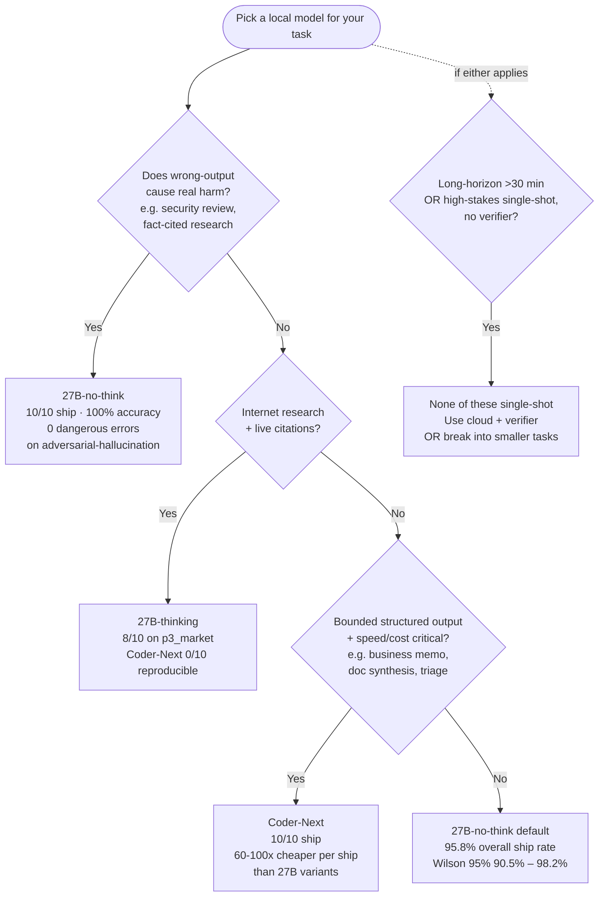

# Local-model head-to-head — Coder-Next vs 27B (thinking) vs 27B (no-think)

> **Five-minute decision doc.** The detail lives in [`SCORECARD.md`](SCORECARD.md) and the per-benchmark `findings*.md` docs; this page is the synthesis. Every claim links to its source so you can drill straight into the evidence.
>
> **Read [`KNOWN-LIMITATIONS.md`](KNOWN-LIMITATIONS.md) before quoting any cell.** Most caveats live there, not here.
>
> **Last updated**: 2026-05-02 — reflects [`microbench-phase-b-2026-05-02`](benchmarks/microbench-phase-b-2026-05-02/) (N=10 + 27B-no-think third arm). Pre-no-think readers: the picture has shifted.

> **Operating point**: All arms are **Cyankiwi 4-bit AWQ** on **2× RTX PRO 6000 Blackwell at 500 W cap**. Other quants, VRAM tiers, hardware classes, and languages are **not characterized** — see [What this benchmark doesn't characterize](#what-this-benchmark-doesnt-characterize) below. The within-quant comparison here is informative; absolute model capability at higher precisions is a separate question.

## TL;DR

**No model is overall best.** The three arms have orthogonal strengths and statistically indistinguishable headline ship rates (74–96%). Pick by task class:

- **Default for most non-coding tasks**: **27B-no-think** — 95.8% ship rate across 12 cells × N=10, beats both originals on raw shipping
- **Hallucination-sensitive or research-driven work**: **27B (either mode)** — 27B-thinking is the only arm that ships market-research at >70%; no-think 10/10 on adversarial-hallucination
- **Bounded structured writing where speed/cost matters**: **Coder-Next** — 60–100× cheaper per shipped run on `p3_business` and `p3_doc`

If you have to pick **one** arm without knowing your task: **27B-no-think**. It dominates raw ship rate, matches thinking-mode on substantive quality (per the [pairwise study](benchmarks/microbench-phase-b-2026-05-02/findings-pairwise-quality-three-model.md)), and has no cell where it's clearly the worst of the three.

## Decision tree

The dotted path is independent of the main flow — even if your task fits the "main path" answers, if it *also* meets the long-horizon-or-high-stakes condition, the local-model answer collapses to "use cloud or add a verifier."

---

## The three arms

| Model | Architecture | Quantization | Notes |
|---|---|---|---|
| **Qwen3-Coder-Next-AWQ** | MoE 80B/3B-active | 4-bit AWQ (Cyankiwi) | Code-specialized; not a thinking model. `--tool-call-parser qwen3_coder` |
| **Qwen3.6-27B-AWQ** (thinking) | Dense 27B | 4-bit AWQ (Cyankiwi) | Default thinking mode. `--tool-call-parser qwen3_xml` |
| **Qwen3.6-27B-AWQ** (no-think) | Dense 27B | 4-bit AWQ (Cyankiwi) | Same model, `--no-think` flag. Added in [`microbench-phase-b-2026-05-02`](benchmarks/microbench-phase-b-2026-05-02/) |

All runs: vLLM, `--temperature 0.3`, `--max-model-len 262144`, Tower2 hardware (2× RTX PRO 6000 Blackwell).

---

## Decision by task class

### "I need this task done reliably and I'll pick one model"

→ **27B-no-think.** [Source](benchmarks/microbench-phase-b-2026-05-02/findings.md): 95.8% ship rate across 12 cells × N=10 (Wilson 95% [90.5%, 98.2%]). On the 4 hardest cells (p2_hallucination, p3_business, p3_doc, p3_market) it's 33/38 = 86.8% — still the highest of the three.

**Caveat**: ship rate ≠ PASS rate. The PASS-rate grader sweep on the no-think tarballs is [pending](benchmarks/microbench-phase-b-2026-05-02/findings.md#recommended-follow-ups). On the cells where quality has been [hand-graded](benchmarks/microbench-phase-b-2026-05-02/findings-pairwise-quality-three-model.md), no-think and thinking are substantively equivalent.

### "I need to avoid confidently-wrong outputs"

→ **27B (either mode).** [Source](benchmarks/microbench-2026-04-28/adversarial-hallucination/) — 6 real bugs vs 9 confident-but-fake fabrications:
- 27B-no-think: 10/10 ship, 100% accuracy, 0 dangerous errors
- 27B-thinking: 7/10 ship, all shipping runs at 100% accuracy
- Coder-Next: 5/10 ship at N=10 (Wilson [23.7%, 76.3%]); the run that ships sometimes lands [2 confirmed-fabrications-as-real](benchmarks/microbench-2026-04-28/findings.md)

**The headline failure cost is asymmetric**: Coder-Next failures are *cheap to detect but expensive to recover from* (you have to verify everything). 27B failures are *expensive to detect* (you have to read prose) but *cheap to recover* (the analysis is usually correct).

### "I need internet research with cited sources"

→ **27B-thinking** (with no-think as a backup). [Source](benchmarks/microbench-phase-b-2026-05-02/findings.md):
- 27B-thinking: 8/10 ship on `p3_market` at N=10 (Wilson 95% [44.4%, 96.5%])
- 27B-no-think: 7/10 ship — comparable but with [scroll-loop pathology](benchmarks/microbench-phase-b-2026-05-02/findings.md#all-identical-call-loops-are-not-the-same-three-subclasses) requiring operator monitoring
- Coder-Next: **0/10** at N=10 (Wilson [0%, 27.8%]) — confirmed reproducible failure shape

**Citation validity**: 27B's URLs were sampled at 75% valid (12/14 testable; [methodology](benchmarks/microbench-2026-04-28/market-research/Qwen3.6-27B-AWQ/)). Error mode is URL drift, **not** fabricated facts (every checkable factual claim matched live data).

### "I need bounded structured writing — fast, cheap, just ship it"

→ **Coder-Next** — when it works for your task class. [Source](benchmarks/microbench-phase-b-2026-05-02/findings.md):
- `p3_business` (memo): Coder-Next 10/10 at $0.0006/run. 27B-thinking 9/10 at $0.0035. **60× cheaper per ship.**
- `p3_doc` (700-word brief from 5 sources): Coder-Next 10/10 at $0.0007/run. 27B-thinking 6/10 at $0.0201. **~100× cheaper per ship.**
- `p2_triage` (customer-support): Coder-Next 96.7% category accuracy vs 27B's 86.7%, and 1.0 min vs 3.3 min wall

### "I need long-horizon autonomous work (>30 min)"

→ **None of these three models, single-shot.** [Source](benchmarks/dreamserver-75-pr-audit/findings-2026-04-27-local-models.md): on the 75-PR audit, 27B writes 75 verdict files but only 3 are real reviews (72 are template stubs); Coder-Next produces nothing across 5 attempts. Both find degenerate failure modes within 30–60 minutes.

If you must use a local model for long-horizon work, structure it as many small independent runs with verification between, not one long agentic chain.

### "I need a high-stakes verdict consumed without a verifier"

→ **None of these three models.** [Source](benchmarks/dreamserver-1-pr-audit/Qwen3-Coder-Next-AWQ/): Coder-Next 2/3 wrong on PR #1057 with **fabricated technical evidence** (line citations to non-existent issues, a fake `test_stderr_truncation.py`). 27B doesn't fabricate but also doesn't write the spec-required `verdict.md`. For high-stakes single-shot, use cloud or add a verifier loop.

---

## Cell-by-cell evidence (the receipts)

### Headline ship rates (phase-b, [source](benchmarks/microbench-phase-b-2026-05-02/findings.md))

Bars show ship rate as a fraction (each bar is 10 segments regardless of N), so N=3 cells stay visually comparable to N=10 cells.

| Cell | Coder-Next | 27B (thinking) | 27B (no-think) | Cell winner |
|---|---|---|---|---|
| p1_bugfix       | ██████████ 2/2  | ░░░░░░░░░░ 0/3 *† | ██████████ 10/10 | 27B-no-think |
| p1_refactor     | ██████████ 3/3  | ███░░░░░░░ 1/3 *† | ██████████ 10/10 | 27B-no-think |
| p1_testwrite    | ███████░░░ 2/3  | ░░░░░░░░░░ 0/3 *† | ██████████ 10/10 | 27B-no-think |
| p2_ci           | ██████████ 3/3  | ██████████ 3/3   | ██████████ 10/10 | tied ship; 27B wins quality (CHANGELOG) |
| p2_extract      | ██████████ 3/3  | ██████████ 3/3   | ██████████ 10/10 | tied ship; 27B more accurate |
| p2_hallucination| █████░░░░░ 5/10 | ███████░░░ 7/10  | ██████████ 10/10 | **27B-no-think** |
| p2_triage       | ██████████ 3/3  | ██████████ 3/3   | ██████████ 10/10 | tied ship; **Coder-Next** more accurate (96.7% vs 86.7%) |
| p3_business     | ██████████ 10/10| █████████░ 9/10  | ████████░░ 8/10  | **Coder-Next** |
| p3_doc          | ██████████ 10/10| ██████░░░░ 6/10  | ████████░░ 8/10  | **Coder-Next** (ship); PASS-rate caveat below |
| p3_market       | ░░░░░░░░░░ 0/10 | ████████░░ 8/10  | ███████░░░ 7/10  | **27B-thinking** |
| p3_pm           | ██████████ 3/3  | ██████████ 3/3   | ██████████ 10/10 | 27B-no-think (ship); all miss multi-week risks |
| p3_writing      | ██████████ 3/3  | ██████████ 3/3   | ██████████ 10/10 | 27B-no-think (ship); see [findings](benchmarks/microbench-2026-04-28/findings.md) |

*† 27B-thinking N=3 baselines used an older harness sha. The 1/9 P1 ship rate may include harness-related effects; see [phase-b caveats](benchmarks/microbench-phase-b-2026-05-02/findings.md#caveats).*

### Quality, where it's been hand-graded

[Pairwise quality study](benchmarks/microbench-phase-b-2026-05-02/findings-pairwise-quality-three-model.md) (N=1, claude-grading-claude — see caveats):

| Cell | Coder-Next | 27B-thinking | 27B-no-think |
|---|:---:|:---:|:---:|
| p2_ci (CHANGELOG vs test name) | 3.4 / 5 (regresses v0.3.0 API) | **4.6 / 5** | 4.2 / 5 |
| p2_extract (20-field accuracy + reasoning) | 4.2 / 5 | **4.6 / 5** | 4.4 / 5 |
| p2_triage (urgency calibration) | 4 / 5 | **4 / 5** | **4 / 5** (no-think aligns with thinking, both > Coder-Next on calibration) |

**Headline from the quality study**: 27B-thinking and 27B-no-think are **tightly correlated on substantive decisions**. The difference between them is verbosity of reasoning prose, not output correctness. Treat them as one "27B model" with a thinking-flag for prose density.

**Coder-Next distinguishes itself by reasoning style** — it trusts artifact-local signals (test names, structural hints) over external documentation. This is a strength on tasks where the test/code IS the spec, and a weakness on tasks where the spec lives in a CHANGELOG / API contract / external doc.

### Long-horizon (dreamserver) — where the agentic regime breaks

| Benchmark | Coder-Next | 27B | Notes |
|---|---|---|---|
| [`dreamserver-1-pr-audit`](benchmarks/dreamserver-1-pr-audit/) (PR #1057) | 1/3 correct verdict (cherry-picked); 2/3 wrong with fabricated evidence | 3/3 implicit-correct verdicts in `review.md`; **0/3 wrote `verdict.md`** | Spec compliance ⊥ correctness |
| [`dreamserver-75-pr-audit`](benchmarks/dreamserver-75-pr-audit/) | 0/5 deliverables (3 distinct degenerate failure modes) | 75 verdict files but only 3 real reviews; 72 stubs; 0 tests | Both fail at multi-hour scope |
| [`wallstreet-intern-test`](benchmarks/wallstreet-intern-test/) | 1/3 ships (DOCU BUY) | 1/3 ships (GTLB BUY) | Verdicts not graded — opinion. Coder-Next caveat: same fabrication risk as PR audit |

27B-no-think on dreamserver-scope tasks is **untested**. The no-think mode's clean shipping on shorter tasks suggests it might also handle multi-section memos cleanly — but that's hypothesis, not finding.

---

## Cost and speed

> All cost numbers are upper-bound (wall × power.limit at $0.13/kWh). Real GPU draw is lower; use for ranking, not absolute economics. Hardware specificity caveat in [`KNOWN-LIMITATIONS.md`](KNOWN-LIMITATIONS.md#hardware-and-platform-caveats).

### Median wall × cost per attempt ([source](benchmarks/microbench-phase-b-2026-05-02/findings.md#median-wall-and-cost-per-run))

| Cell | Coder-Next | 27B (thinking) | 27B (no-think) |
|---|---|---|---|
| p2_extract | 17 s / $0.0004 | 71 s / $0.0015 | 49 s / $0.0009 |
| p2_triage | 62 s / $0.0013 | 197 s / $0.0043 | 154 s / $0.0028 |
| p2_hallucination | 422 s / $0.0092 | 171 s / $0.0037 | **127 s / $0.0023** |
| p3_business | **31 s / $0.0006** | 163 s / $0.0035 | 171 s / $0.0031 |
| p3_doc | **37 s / $0.0007** | 1113 s / $0.0201 | 144 s / $0.0026 |
| p3_market | 2294 s / $0.0435 | 1720 s / $0.0330 | 2277 s / $0.0411 |

### Cost per *shipped* run — the decision number

When a model fails to ship, you still paid for the wall. Cost-per-shipped-run is the real economics:

| Cell | Coder-Next | 27B (thinking) | 27B (no-think) |
|---|---:|---:|---:|
| p2_hallucination | $0.0318 (5/10) | $0.0045 (7/10) | **$0.0023** (10/10) |
| p3_business | **$0.0006** (10/10) | $0.0039 (9/9) | $0.0536 (8/10) |
| p3_doc | **$0.0007** (10/10) | $0.0712 (6/8) | $0.0495 (8/10) |
| p3_market | ∞ (0/10) | $0.0459 (8/10) | **$0.0493** (7/8) |

**No model wins on cost across all four cells** — picking by cost requires picking by task class.

### p95 wall (cost of pathological runs)

| Cell | Worst arm | p95 wall | Failure |
|---|---|---|---|
| p3_doc | 27B (thinking) | **133 min / $0.144** | identical-call-loop on word-trim |
| p3_business | 27B (no-think) | 53 min / $0.057 | identical-call-loop |
| p2_hallucination | Coder-Next | 28 min / $0.036 | stuck-no-progress |

The 27B-thinking p95 of 133 min on `p3_doc` is the single most expensive failure mode in the dataset. **27B-no-think halves the loop rate** (4/10 → 2/10).

---

## Failure-mode profiles (different shapes, different costs)

Each arm has a signature failure profile. Knowing the shape lets you build around it.

### Coder-Next

- `stuck_no_workspace_change_for_500_iters` — reads code without writing artifacts
- `api_error: HTTP Error 400` — fills the 262K context budget without converging (notably on `p3_market`)
- `wall_killed_low_progress_bash_loop` — bash-shaped degenerate loops
- **Confidently-wrong-with-fabricated-evidence when it does ship** — the dangerous mode (see [PR #1057 evidence](benchmarks/dreamserver-1-pr-audit/Qwen3-Coder-Next-AWQ/))
- *Doesn't* enter `wall_killed_identical_call_loop` (different loop substrate than 27B)

### 27B-thinking

- `wall_killed_identical_call_loop` — word-budget retry loops on tight-output tasks
  - Subclass: `word-trim-loop` ([source](benchmarks/microbench-phase-b-2026-05-02/findings.md#all-identical-call-loops-are-not-the-same-three-subclasses)) — write brief → count words → over budget → trim → recount → loop
- `model_stopped` (floor-failure) on some cells where no-think completes — *faster-because-failed isn't a win*
- `partial-no-spec-output` — writes good content in wrong file (e.g. analysis in `review.md` instead of required `verdict.md`)
- *Doesn't* fabricate confident-but-wrong claims with citations

### 27B-no-think

- `wall_killed_identical_call_loop` (lower rate than thinking — 2/10 vs 4/10 on `p3_doc`)
- **Two new pathologies** discovered during the no-think grid (now in [`tooling/FAILURE-TAXONOMY.md`](tooling/FAILURE-TAXONOMY.md)):
  - `scroll-loop` — model walks an HTML response in fixed-byte slices for 30+ iters; raw command hashes differ each iter so harness's same-content guard doesn't fire. Run [`tooling/scripts/check_substance.py`](tooling/scripts/check_substance.py) every 5 min on long chains to catch
  - `runaway-generation` — single response exceeds max-output-tokens budget without stopping (137,855 tokens in `p3_market_27b-nothink_v5`)
- **Caveat**: lighter reasoning prose than thinking-mode. Decision quality is equivalent on hand-graded cells; provenance prose is sparser.

---

## What we don't know yet

These would tighten the picture:

1. **PASS-rate grader sweep on no-think tarballs.** Current data is `done_signal` rate, not PASS rate. The `p3_doc` 8/10 ship rate could be paying real PASS rate or could be shipping briefs that miss the 700-word limit. [Status](benchmarks/microbench-phase-b-2026-05-02/findings.md#recommended-follow-ups): pending.
2. **27B-no-think on dreamserver-scope tasks.** The no-think arm hasn't been run against the 1-PR or 75-PR audit. The scroll-loop monitoring methodology proven on phase-b would transfer; the verdict-production issue 27B-thinking had on PR #1057 *might* improve with no-think but that's a hypothesis.
3. **27B-no-think on wallstreet.** Untested. Given 8/10 ship on `p3_business` and `p3_doc`, plausible it would handle the multi-section memo cleanly — but unmeasured.
4. **Citation validity at full sample on `p3_market` 27B.** 18/33 URLs sampled, 75% valid. Remaining 15 unverified.
5. **Per-claim rubric on cloud entries.** Cloud Opus-4.7 / GPT-5.5 entries weren't graded with the same methodology as local entries; cloud-vs-local comparison is currently *categorical* only ("cloud ships, local mostly doesn't"), not per-claim accuracy. See [KNOWN-LIMITATIONS.md § Comparison-to-cloud](KNOWN-LIMITATIONS.md#comparison-to-cloud-caveats).

---

## What this benchmark doesn't characterize

The findings above apply to a single operating point. Outside this point, the picture shifts in ways this study doesn't measure. Each item below is a real follow-up that contributors are welcome to pick up — see [`ROADMAP.md`](ROADMAP.md) for the prioritized list.

### Other quants of the same models

All three arms use **Cyankiwi 4-bit AWQ** community quants. Multiple field reports (see [`KNOWN-LIMITATIONS.md` § Cyankiwi 4-bit AWQ field reports](KNOWN-LIMITATIONS.md#quantization-specificity)) suggest these specific quants underperform the official Qwen FP8 quants and Unsloth UD4 GGUFs of the same base models — describing degraded output coherence and increased loop pathologies on certain task shapes.

What this means for the data here:
- Within-quant comparison (Coder-Next vs 27B at the same Cyankiwi 4-bit AWQ) **is** informative — the differential is a model-behavior gap, not a quant artifact.
- Absolute model capability at higher precision (FP8 / UD4 / BF16) is **not** characterized.
- Effects that depend on a thinking-mechanism (the `--no-think` ship-rate jump, the word-trim loop reduction) are **unlikely to be quant-specific** — they're about the trace, not the weights' precision.

The FP8 re-run is the highest-priority follow-up.

### Other VRAM tiers

Tested at 96 GB-per-GPU. The published vLLM flags (`--max-model-len 262144`, `--gpu-memory-utilization 0.92`) will OOM on consumer 24-48 GB cards. At those tiers the choice isn't "which model wins at 4-bit AWQ" — it's "27B Q8 fits cleanly but Coder-Next needs Q4-with-CPU-offload, which dominates the wall time." That's a different study entirely; this one doesn't address it.

### Other hardware classes

Comparison is **Nvidia/dense-VRAM** operating point. On Mac M-series unified memory the dense-vs-MoE compute tradeoff inverts: 3B-active wins on tokens-per-second (Coder-Next looks much better), full-dense compute is the bottleneck (27B looks much worse). The harness is portable — only the vLLM launch swaps for MLX — so this is a sibling study someone with M-series hardware could run.

### Languages other than Python

Phase 1 coding tasks (`p1_bugfix`, `p1_refactor`, `p1_testwrite`) all use a Python project (`logalyzer`). No C, JavaScript, systems-programming, browser front-end, or low-level work tested. Coder-Next is code-specialized; its relative performance on languages it's tuned harder for is plausibly different from what shows up here. Phase 2 / Phase 3 tasks are mostly business/text and language-agnostic.

### Single-rig hardware

All measurements on one Blackwell rig at 500 W cap. Cross-rig variance not bounded. Power-cap effects are characterized separately in [`hardware-tests/vllm-power-sweep-2026-04-29/`](hardware-tests/vllm-power-sweep-2026-04-29/) but only on this rig.

---

## Drilling deeper

| If you want… | Read |
|---|---|
| The full per-cell tables with Wilson CIs | [`microbench-phase-b-2026-05-02/findings.md`](benchmarks/microbench-phase-b-2026-05-02/findings.md) |
| The original N=3 baseline (still current for the 8 non-Phase-B cells) | [`microbench-2026-04-28/findings.md`](benchmarks/microbench-2026-04-28/findings.md) |
| Side-by-side hand-graded deliverable quality | [`microbench-phase-b-2026-05-02/findings-pairwise-quality-three-model.md`](benchmarks/microbench-phase-b-2026-05-02/findings-pairwise-quality-three-model.md) |
| Long-horizon agentic failure modes | [`dreamserver-75-pr-audit/findings-2026-04-27-local-models.md`](benchmarks/dreamserver-75-pr-audit/findings-2026-04-27-local-models.md) |
| The single grand summary table | [`SCORECARD.md`](SCORECARD.md) |
| Caveats before quoting any number | [`KNOWN-LIMITATIONS.md`](KNOWN-LIMITATIONS.md) |
| The failure-mode vocabulary | [`tooling/FAILURE-TAXONOMY.md`](tooling/FAILURE-TAXONOMY.md) |
| How to add your own model to this comparison | [`tooling/ADDING-A-MODEL.md`](tooling/ADDING-A-MODEL.md) |
