# Dependency Graph

## Critical Chains

```mermaid
graph TD
  P1006["#1006 log/warn stderr"] --> P1018["#1018 strict mode draft"]
  P1007["#1007 RETURN trap"] --> P1018
  P1008["#1008 version fallback pipefail guard"] --> P1018
  P1023["#1023 SIGPIPE-safe head"] --> P1018
  P1008 --> P1002["#1002 nounset/pipefail draft"]
  P1008 --> P998["#998 pipefail draft"]

  P1021["#1021 install up without --no-deps"] --> P1032["#1032 compose depends_on"]
  P1021 --> P1039["#1039 draft install state"]
  P1030["#1030 install state verifier"] --> P1039
  P1030 --> P1040["#1040 Langfuse hook draft"]

  P1044["#1044 scanner accepts BIND_ADDRESS default syntax"] --> P1027["#1027 bind-address sweep"]
  P988["#988 loopback bind defaults"] --> P973["#973 broad docs"]
  P988 --> P1017["#1017 security docs draft"]

  P1049["#1049 Jupyter exec-form"] -. supersedes Jupyter half .-> P1033["#1033 LibreChat/Jupyter env guards"]
  P1051["#1051 user extension fallback"] -. partial successor .-> P1029["#1029 user extension manifest filter"]
```

## Overlap Clusters

### Installer / Host Agent

PRs: #1057, #1054, #1045, #1030, #1039, #1040, #1032, #1021, #1050, #1048, #1043, #1026, #1013, #1012, #1005, #996, #988, #974.

Risk: many touch install lifecycle, host-agent dispatch, or platform setup. Merge focused foundations first, then rebase drafts.

### Extension Compose / Library

PRs: #1049, #1047, #1046, #1040, #1036, #1035, #1034, #1033, #1032, #1028, #1027, #1054, #1056, #1057.

Risk: compose fragments are not independent if they are evaluated in the merged stack. Required env guards in one service can break unrelated operations.

### Resolver / CLI Strict Mode

PRs: #1051, #1029, #1024, #1023, #1018, #1016, #1011, #1008, #1007, #1006, #1002, #998, #997, #1000, #994.

Risk: Bash strict mode is desirable but exposes many latent non-zero pipelines. Merge surgical guards before broad strict-mode PRs.

### Dashboard / Setup API

PRs: #1025, #1022, #1020, #1019, #1015, #1014, #1010, #1009, #1003, #1002, #364, #351.

Risk: frontend tests and backend API contracts drift; old conflicting API work should not be merged without rebase.

### Docs / Support

PRs: #1055, #1053, #1042, #1017, #973, #966, #959.

Risk: docs must follow the actual binding/install decisions, especially #988.

### GPU / AMD / Platform

PRs: #750, #983, #961, #1009, #999, #1025, #1020, #1050, #988.

Risk: AMD and mobile/GPU paths have high partnership/user trust impact and need platform-specific proof.

## Supersede / Redundancy

- #966 should be closed as superseded.
- #1033's Jupyter part is superseded by #1049; keep/rework only the LibreChat guard.
- #1029 is directionally superseded by #1051, but #1051 still needs work.
- #973 must be reconciled with #988/#1017 before merge.

## Dependency-Blocked PRs

- #1032 depends on #1021.
- #1027 depends on #1044.
- #1040 and #1039 depend on #1030, which itself needs work.
- #1017 depends on #988.
- #1016/#1011 should wait for focused strict-mode fixes.
