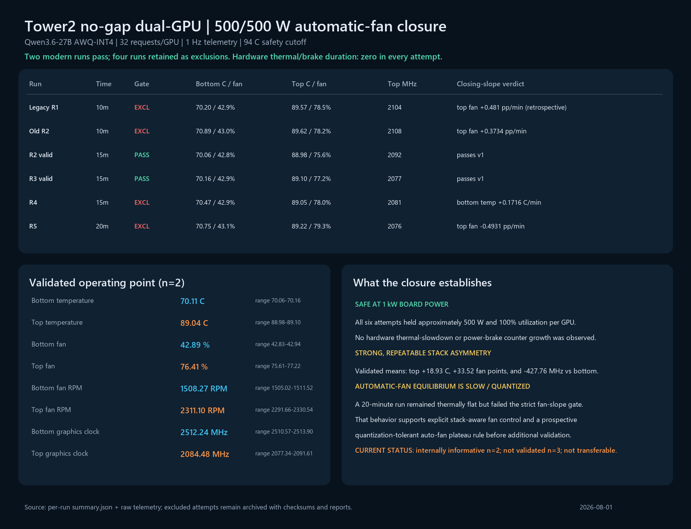

# 500/500 W automatic-fan closure

## Result

`NG-SYM-500` closes this campaign as **internally informative at n=2, not validated at n=3, and not transferable**. Two independently initialized 15-minute runs pass every modern internal quality gate. Four additional attempts remain published but are excluded by the prospective closing-slope rules, including the original 10-minute anchor after retrospective audit.

The machine-readable attempt table is [`500w-auto-fan-observations.csv`](500w-auto-fan-observations.csv); the two-run admissible summary is [`500w-auto-fan-valid-n2-summary.csv`](500w-auto-fan-valid-n2-summary.csv).

## Valid operating point

Across the two admissible runs, each GPU held approximately 500 W and 100% utilization:

| Response | Bottom GPU0 | Top GPU1 | Top minus bottom |
|---|---:|---:|---:|
| Mean GPU temperature | 70.109 C | 89.037 C | +18.928 C |
| Mean fan percentage | 42.888% | 76.411% | +33.523 pp |
| Mean physical fan speed | 1508 RPM | 2311 RPM | +803 RPM |
| Mean graphics clock | 2512.237 MHz | 2084.476 MHz | -427.761 MHz |

The top-card temperature means differ by only 0.122 C between the two admissible observations. Both runs recorded zero hardware thermal-slowdown and power-brake counter growth. Top-card software-thermal counter time was 0.339 and 0.680 seconds out of 900 seconds (0.038% and 0.076%); these are retained as brief boundary events, not sustained hardware throttling.

## Why four attempts are excluded

| Attempt | Duration | Exclusion |
|---|---:|---|
| Legacy R1 | 10 min | Retrospective top-fan closing slope +0.481 pp/min |
| Old R2 | 10 min | Top-fan closing slope +0.3734 pp/min |
| R4 | 15 min | Bottom temperature closing slope +0.1716 C/min after a late integer-sensor step |
| R5 | 20 min | Top-fan closing slope -0.4931 pp/min while top temperature slope was only +0.0098 C/min |

R5 is especially informative. It began after a 604-second idle soak ending at 29 C / 32 C and ran for 20 measured minutes, yet the top automatic fan still oscillated by integer percentage points late in the run. Its temperature was flat and all hardware counters were clear. The current v1 rule correctly prevents it from entering a frozen model, but the result also shows that a strict linear slope on quantized automatic-fan samples can reject a thermally stable controller limit cycle.

## Interpretation

The no-gap stack is safe at 500/500 W under this workload and Tower2 chassis state within the observed windows, but the top card pays a large cooling and performance cost: about +18.9 C, +33.5 fan percentage points, and -428 MHz relative to the bottom card at equal board power. This is heat-associated boost loss whether or not a hardware thermal flag is asserted. It is not evidence of sustained hardware thermal throttling because power and utilization hold, hardware counters remain zero, and the clocks do not collapse over time.

The slow, quantized automatic-fan behavior strengthens the case for stack-aware fan coordination. Before another auto-fan validation round, define a prospective plateau rule that tolerates bounded controller hunting (for example, minute-median temperature range plus bounded fan range) without weakening the safety cutoff. Do not retroactively apply such a rule to promote the excluded runs.

No ambient or per-card inlet probes were available. These results support the internal Tower2/no-gap model only and must not be presented as transferable rack-design limits.

