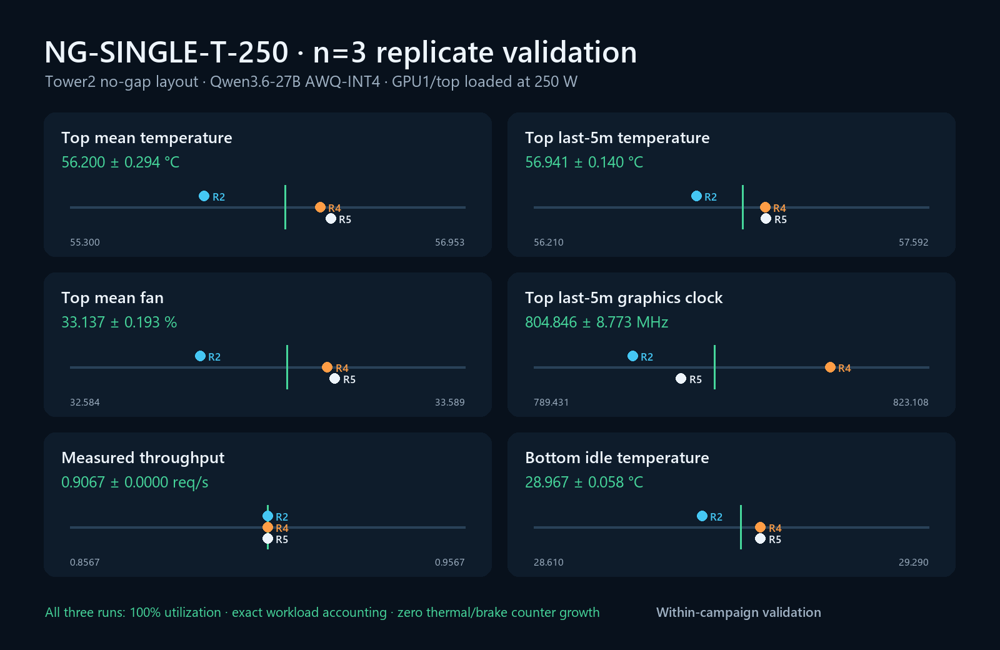

# NG-SINGLE-T-250 within-campaign validation

## Scope

This validation cell loads only GPU1/top with Qwen3.6-27B AWQ-INT4 at a 250 W cap while GPU0/bottom remains model-resident but workload-isolated and idle. Both RTX PRO 6000 Blackwell Workstation Edition cards are directly adjacent with no open-slot air gap.

Three independently initialized execution blocks passed the workload-isolation, power, completeness, steady-state, and counter gates. Replicates 1 and 3 remain published but are excluded: replicate 1 developed late background-power contamination on GPU0, while replicate 3 was automatically aborted when an external OpenClaw request reached Sanctuary.

## Admissible runs

| Replicate | Loaded top mean / last-5m temp | Top fan | Top last-5m clock | Throughput | Idle bottom temp |
|---:|---:|---:|---:|---:|---:|
| 2 | 55.862 / 56.779°C | 32.915% | 797.850 MHz | 0.9067 req/s | 28.900°C |
| 4 | 56.347 / 57.020°C | 33.239% | 814.689 MHz | 0.9067 req/s | 29.000°C |
| 5 | 56.391 / 57.023°C | 33.258% | 802.000 MHz | 0.9067 req/s | 29.000°C |

## Aggregate result

Values are arithmetic mean ± sample standard deviation across the three admissible runs.

| Response | Mean ± SD | Range | CV |
|---|---:|---:|---:|
| GPU1 loaded board power | 249.9943 ± 0.0006 W | 249.994–249.995 W | 0.0002% |
| GPU1 mean temperature | 56.200 ± 0.294°C | 55.862–56.391°C | 0.52% |
| GPU1 last-5m temperature | 56.941 ± 0.140°C | 56.779–57.023°C | 0.25% |
| GPU1 mean fan speed | 33.137 ± 0.193% | 32.915–33.258% | 0.58% |
| GPU1 last-5m graphics clock | 804.846 ± 8.773 MHz | 797.850–814.689 MHz | 1.09% |
| GPU1 measured throughput | 0.9067 ± 0.0000 req/s | 0.9067–0.9067 req/s | 0.00% |
| GPU0 idle board power | 18.350 ± 0.212 W | 18.150–18.572 W | 1.15% |
| GPU0 idle temperature | 28.967 ± 0.058°C | 28.900–29.000°C | 0.20% |

All three loaded runs held 100% GPU utilization and at least 95% of the 250 W target for every measured telemetry sample. Each produced 544 measured-window HTTP 200 responses, zero controlled errors, and an exact match between the full-phase controlled request count and Sanctuary’s success-counter delta. Hardware thermal, software thermal, and hardware power-brake counter deltas were zero.

## Interpretation and limits

The cell demonstrates highly repeatable within-campaign behavior for a top-loaded/bottom-idle 250 W no-gap configuration. It establishes the top card’s isolated self-heating response and a clean lower boundary for top-to-bottom coupling: the idle bottom card remained effectively fixed at 29°C.

This result is suitable for the internal Tower2 two-card model. It is not yet transferable to other chassis because ambient and local-inlet temperatures were not measured, and the three runs occurred during one campaign session. Cross-session replication and calibrated environmental probes are required before treating the absolute temperatures or inferred thermal resistances as general server-design constants.

