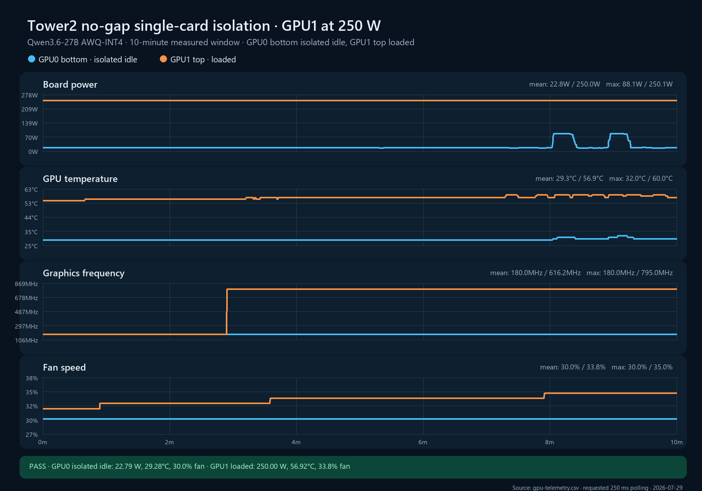

# Bottom idle / top 250 W isolation run

**Measured window:** 10 minutes
**Layout:** GPU0 bottom and GPU1 top directly adjacent, no open-slot gap
**Workload:** Qwen3.6-27B AWQ-INT4 on GPU1 with 32 concurrent requests; GPU0 had no test model or test workers
**Power limits:** 250 W on both cards
**GPU telemetry:** fixed-period 250 ms schedule
**Environmental normalization:** unavailable; no external ambient or inlet probes were attached

## Result

The run passed its safety and workload-integrity gates. GPU1 held 250.0 W and 100% utilization for the entire measured window. Neither GPU recorded software thermal, hardware thermal, or hardware power-brake counter growth. The corrected logger captured 2,401 samples per GPU against 2,400 expected.

| Metric | GPU0 bottom, nominally idle | GPU1 top, loaded |
|---|---:|---:|
| Mean board power | 22.785 W | 249.995 W |
| First-5-minute mean board power | 18.548 W | 249.995 W |
| Mean / max core temperature | 29.277 / 32°C | 56.916 / 60°C |
| First-5-minute mean temperature | 29.000°C | 56.162°C |
| Last-5-minute mean temperature | 29.555°C | 57.669°C |
| Mean fan speed | 30.000% | 33.754% |
| Mean graphics clock | 180.000 MHz | 616.212 MHz |
| Last-5-minute mean graphics clock | 180.000 MHz | 795.000 MHz |
| Mean GPU utilization | 0.002% | 100% |
| SW/HW thermal counter delta | 0 / 0 µs | 0 / 0 µs |
| Hardware power-brake counter delta | 0 µs | 0 µs |

The idle bottom card remained exactly 29°C throughout the uncontaminated first five minutes while the top card held 250 W. This is the direction-reversed counterpart to the bottom-loaded cell, in which the idle top rose approximately 14°C above its pre-run value. The result supports strongly directional bottom-to-top coupling in this chassis.

## Quality flags

This run is retained as a valid but qualified isolation cell:

- GPU0 had no test workload, but two `openclaw-gateway.service` local-embedding worker contexts remained attached. They produced late board-power plateaus of approximately 86–88 W while sampled GPU utilization stayed at 0–1%. GPU0's first-five-minute interval was clean at 18.55 W and 29.0°C; the last-five-minute interval is not a pure idle control.
- GPU1 alternated between 180/405 MHz and 795/13,365 MHz clock samples early in the run. Independent five-second `nvidia-smi dmon` sampling and vLLM counters confirmed active generation at approximately 922 tokens/s; the last five minutes held 795 MHz continuously.
- GPU1 ended with temperature and fan slopes of +0.3835°C/min and +0.4302 percentage points/min. It therefore did not meet the study's strict steady-state criterion despite remaining far from a thermal limit.

These flags do not erase the clean first-five-minute directional observation, but the cell must be repeated with the OpenClaw embedding workers stopped and a longer settling window before it is used as a final model coefficient.

## Workload integrity

GPU1 completed 448 requests with 448 HTTP 200 responses. The lower whole-window completion rate and 100-second upper request-duration mode correspond to the early clock-state transition; last-five-minute graphics frequency was stable at 795 MHz.

