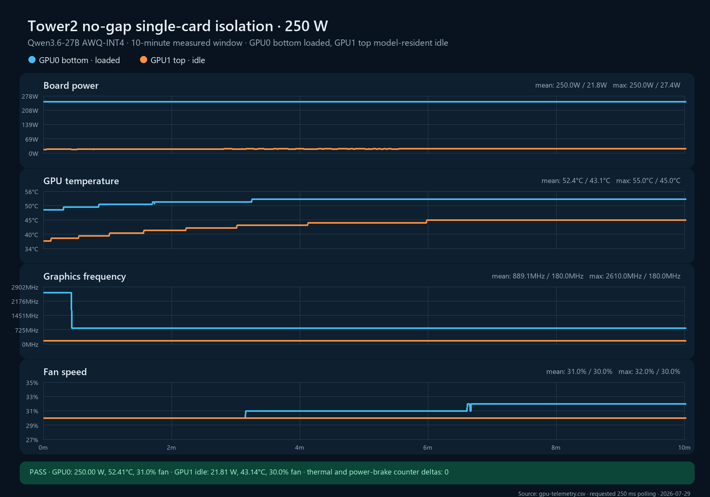

# Bottom 250 W / top model-resident idle isolation run

**Measured window:** 10 minutes  
**Layout:** GPU0 bottom and GPU1 top directly adjacent, no open-slot gap  
**Workload:** Qwen3.6-27B AWQ-INT4 on GPU0 with 32 concurrent requests; the resident Qwen model on GPU1 had zero running or waiting requests  
**Power limits:** 250 W on both cards  
**GPU telemetry request:** 250 ms  
**Environmental normalization:** unavailable; no external ambient or inlet probes were attached

## Result

The run passed. GPU0 held 250.0 W and 100% utilization for the entire measured window. GPU1 remained at 0% utilization and 21.8 W mean board power. Neither GPU recorded software thermal, hardware thermal, or hardware power-brake counter growth.

| Metric | GPU0 bottom, loaded | GPU1 top, idle |
|---|---:|---:|
| Mean board power | 249.995 W | 21.809 W |
| Mean / max core temperature | 52.414 / 55°C | 43.137 / 45°C |
| Last-5-minute mean temperature | 53.031°C | 44.805°C |
| Mean fan speed | 31.021% | 30.000% |
| Mean graphics clock | 889.077 MHz | 180.000 MHz |
| Last-5-minute mean graphics clock | 810.000 MHz | 180.000 MHz |
| Mean GPU utilization | 100% | 0% |
| SW/HW thermal counter delta | 0 / 0 µs | 0 / 0 µs |
| Hardware power-brake counter delta | 0 µs | 0 µs |

GPU1 began at 31°C before the workload and reached a 44.8°C last-five-minute mean while remaining idle. This approximately 14°C rise is direct evidence that a loaded bottom card heats the adjacent top position through the shared air path and/or radiative/conductive coupling. It should not yet be converted into an ambient-normalized thermal resistance because local intake and room temperature were not instrumented.

GPU0's last-three-minute slopes were 0.0025°C/min for temperature and 0 percentage points/min for fan, meeting the study's steady-state criterion. GPU1's corresponding temperature and fan slopes were both zero.

## Workload integrity

GPU0 completed 576 requests with 576 HTTP 200 responses, or 0.96 completed requests/s. Request duration averaged 33.443 seconds. GPU1 completed no test requests, as intended.

The requested 250 ms polling delay yielded 1,821 measured samples per GPU, approximately 3.03 samples/s, because `nvidia-smi` execution time was additive in this harness revision. Raw monotonic timestamps preserve the true cadence. The harness was changed immediately after this run to schedule against a fixed period.

