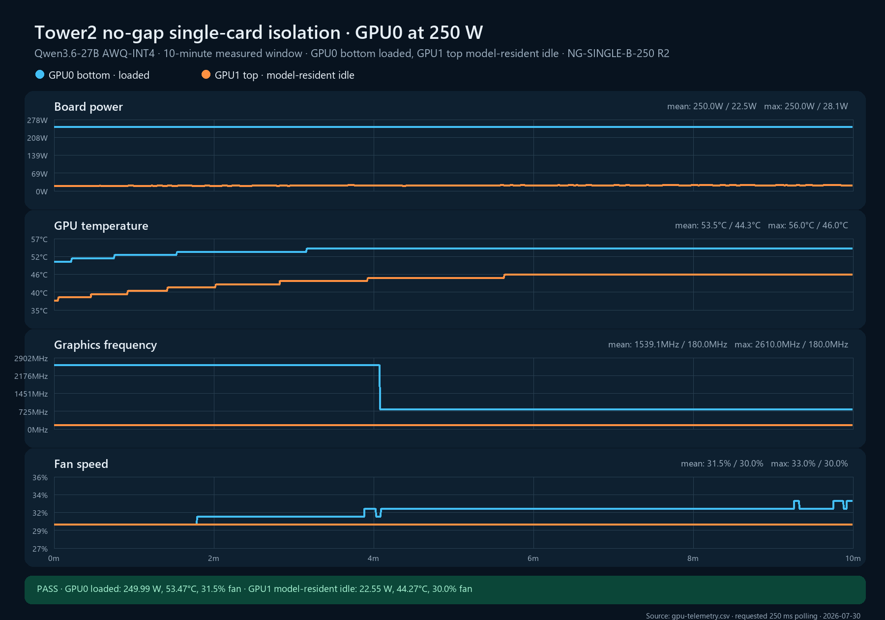

# NG-SINGLE-B-250 replicate 2

**Cell:** NG-SINGLE-B-250  
**Replicate:** 2  
**Measured window:** 10 minutes  
**Layout:** GPU0 bottom and GPU1 top directly adjacent, no open-slot gap  
**Workload:** Qwen3.6-27B AWQ-INT4 on GPU0 with 32 controlled requests; GPU1 model-resident and workload-isolated idle  
**Power limits:** 250 W on both cards  
**Validation classification:** internally admissible; not transferable without ambient/local-inlet probes

## Result

The replicate passed every automatic quality gate. GPU0 held the requested load and power, GPU1 stayed below the idle-power ceiling with zero utilization, sampling was complete, both temperature slopes met the steady-state gate, and the GPU1 Sanctuary success counter remained unchanged as required.

| Metric | GPU0 bottom, loaded | GPU1 top, model-resident idle |
|---|---:|---:|
| Samples / expected | 2,399 / 2,400 | 2,399 / 2,400 |
| Mean board power | 249.994 W | 22.548 W |
| Mean / max core temperature | 53.465 / 56°C | 44.266 / 46°C |
| Last-5-minute mean temperature | 54.042°C | 45.863°C |
| Mean fan speed | 31.457% | 30.000% |
| Mean graphics clock | 1,539.067 MHz | 180.000 MHz |
| Last-5-minute mean graphics clock | 802.000 MHz | 180.000 MHz |
| Mean GPU utilization | 100% | 0% |
| Temperature slope, last 3m | −0.0104°C/min | 0.0000°C/min |
| Fan slope, last 3m | +0.1523 pp/min | 0.0000 pp/min |
| SW/HW thermal counter delta | 0 / 0 µs | 0 / 0 µs |
| Hardware power-brake counter delta | 0 µs | 0 µs |

GPU0 completed 544 measured-window requests at 0.9067 requests/s. Mean request duration was 33.473 seconds. Across setup, warm-up, measurement, and the phase-transition boundary, `requests.csv` recorded 672 controlled HTTP 200 responses with zero errors. GPU1/Sanctuary recorded no successful-request counter growth, exactly matching the zero controlled GPU1 requests.

GPU0 stayed at 100% utilization and 250 W while its reported graphics clock moved from a 2,610 MHz plateau to an 802 MHz plateau around minute four. Temperature, fan, workload throughput, and thermal counters remained stable across the transition. It is therefore preserved as workload/boost phase behavior rather than classified as thermal slowdown.

The idle top card rose from 38°C at the beginning of the measured window to 46°C, then held 46°C through the closing portion. Its 45.863°C last-five-minute mean demonstrates substantial bottom-to-top neighbor heating even though it averaged only 22.548 W and remained at 0% utilization.

This is the first internally admissible member of the required `n=3` validation set. The earlier replicate 1 pilot remains excluded because OpenClaw GPU0 work was not isolated.

