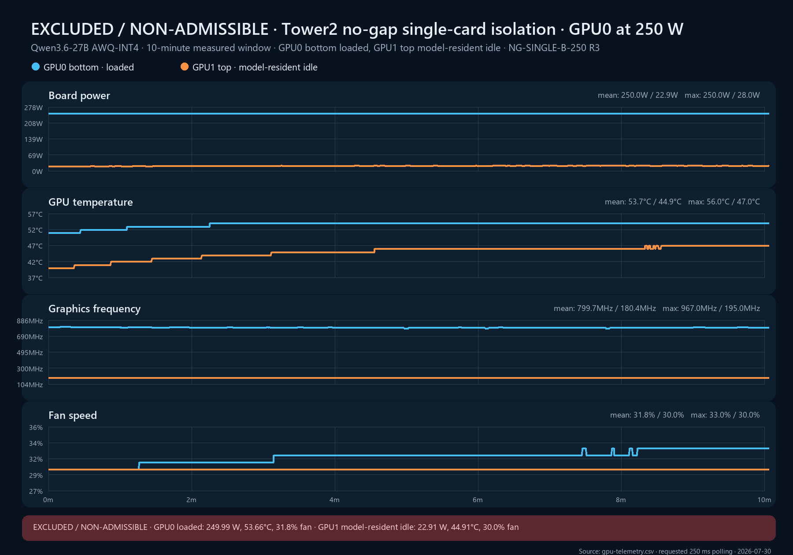

# NG-SINGLE-B-250 replicate 3 — excluded

**Cell:** NG-SINGLE-B-250  
**Replicate:** 3  
**Measured window:** 10 minutes  
**Layout:** GPU0 bottom and GPU1 top directly adjacent, no open-slot gap  
**Workload:** Qwen3.6-27B AWQ-INT4 on GPU0 with 32 controlled request workers; GPU1 model-resident and workload-isolated idle  
**Power limits:** 250 W on both cards  
**Validation classification:** excluded from `n`; closing thermal/fan slopes did not reach steady state

## Result

The run completed without request errors, power deviation, workload contamination, thermal slowdown, or hardware power-brake events. It is nevertheless excluded because both cards failed the predeclared steady-state gate:

| Closing three-minute slope | Observed | Limit | Result |
|---|---:|---:|---|
| GPU0 loaded fan | +0.4158 pp/min | \|slope\| < 0.2 pp/min | Fail |
| GPU1 idle temperature | +0.4834°C/min | \|slope\| < 0.1°C/min | Fail |

| Metric | GPU0 bottom, loaded | GPU1 top, model-resident idle |
|---|---:|---:|
| Mean board power | 249.994 W | 22.913 W |
| Mean / max core temperature | 53.656 / 56°C | 44.908 / 47°C |
| Last-5-minute mean temperature | 54.043°C | 46.303°C |
| Mean fan speed | 31.758% | 30.000% |
| Primary mean graphics clock | 799.680 MHz | 180.385 MHz |
| Independent NVML mean graphics clock | 799.476 MHz | 180.385 MHz |
| Mean GPU utilization | 100% | 0% |
| Measured throughput | 0.9517 req/s | 0 req/s |
| Mean request duration | 33.608 s | — |
| SW/HW thermal counter delta | 0 / 0 µs | 0 / 0 µs |

The independent randomized NVML sampler validated the frequency channel: GPU0’s primary and independent means differ by only 0.204 MHz, with a primary-to-independent ratio of 1.000255. This confirms that the approximately 795–802 MHz loaded operating point was genuine in this run.

Immediately before R3, an unrelated production request had operated GPU1/top near 600 W and approximately 90°C. The strengthened preflight correctly isolated OpenClaw and waited until both GPU cores were below the start thresholds, but residual chassis/inter-card thermal mass was not directly measured. GPU1 subsequently continued warming through the end of the controlled run while remaining at 0% utilization.

The result demonstrates that GPU core temperature alone is an insufficient history-control variable after a major preceding heat load. Future replicates require a continuous idle/cool soak after the basic temperature/utilization gates. R3 remains useful evidence for thermal hysteresis and clock-sampler validation but contributes zero observations to the validated cell aggregate.

