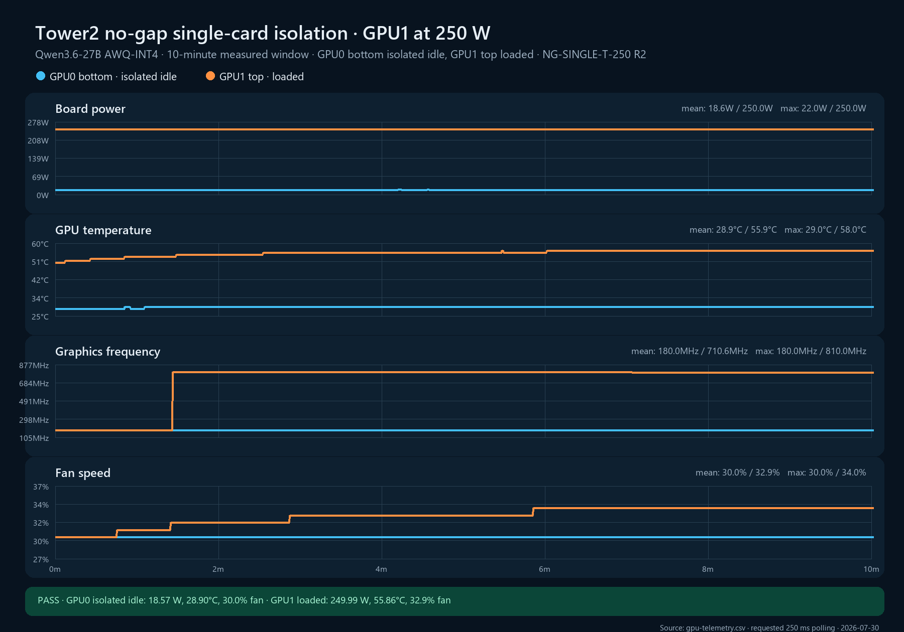

# NG-SINGLE-T-250 replicate 2

**Cell:** NG-SINGLE-T-250  
**Replicate:** 2  
**Measured window:** 10 minutes  
**Layout:** GPU0 bottom and GPU1 top directly adjacent, no open-slot gap  
**Workload:** Qwen3.6-27B AWQ-INT4 on GPU1 with 32 controlled requests; GPU0 isolated idle  
**Power limits:** 250 W on both cards  
**GPU telemetry:** fixed-period 250 ms schedule  
**Validation classification:** internally admissible; not transferable without ambient/local-inlet probes

## Result

The replicate passed all internal quality gates. GPU1 held 250 W and 100% utilization for the entire measured window. GPU0 remained at 0% utilization and below the 50 W isolation limit. Both cards met the strict steady-state slope criterion, and all software thermal, hardware thermal, and hardware power-brake counter deltas were zero.

| Metric | GPU0 bottom, isolated idle | GPU1 top, loaded |
|---|---:|---:|
| Samples / expected | 2,408 / 2,400 | 2,408 / 2,400 |
| Mean board power | 18.572 W | 249.994 W |
| Mean / max core temperature | 28.900 / 29°C | 55.862 / 58°C |
| Last-5-minute mean temperature | 29.000°C | 56.779°C |
| Mean fan speed | 30.000% | 32.915% |
| Mean graphics clock | 180.000 MHz | 710.563 MHz |
| Last-5-minute mean graphics clock | 180.000 MHz | 797.850 MHz |
| Mean GPU utilization | 0% | 100% |
| Temperature slope, last 3m | 0.0000°C/min | +0.0259°C/min |
| Fan slope, last 3m | 0.0000 pp/min | 0.0000 pp/min |
| SW/HW thermal counter delta | 0 / 0 µs | 0 / 0 µs |
| Hardware power-brake counter delta | 0 µs | 0 µs |

## Isolation and workload verification

- GPU0 power was 16.92–22.02 W, with an 18.57 W mean and no utilization samples above 0%.
- The previously identified OpenClaw embedding worker was absent throughout the measured window.
- The before/after Sanctuary metrics recorded exactly 672 successful requests, matching the 672 controlled HTTP 200 responses in `requests.csv`; no uncontrolled Sanctuary request is present.
- GPU1 completed 544 measured-window requests, or 0.9067 requests/s. Mean request duration was 34.841 seconds.
- Cleanup restored the original 600 W limits and all stopped GPU services.

## Comparison with the qualified pilot

Compared with the contaminated/non-steady top-only pilot, the clean replicate reduced GPU1 mean temperature by 1.054°C, mean fan demand by 0.839 percentage points, and mean request duration from 42.568 to 34.841 seconds. Last-five-minute graphics frequency increased from 795.0 to 797.85 MHz.

This is the first internally admissible member of the required three-replicate validation set. It is `n=1/3`, not a validated cell by itself.

[`validation-audit.json`](validation-audit.json) contains the machine-readable per-GPU, workload-isolation, internal-admissibility, and transferable-admissibility gate results.

