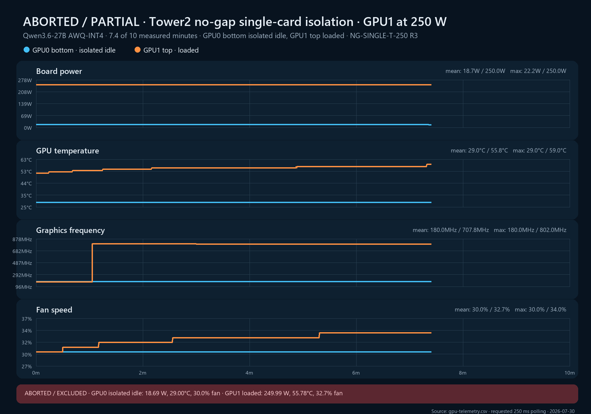

# NG-SINGLE-T-250 replicate 3 — excluded

**Cell:** NG-SINGLE-T-250  
**Replicate:** 3  
**Planned measured window:** 10 minutes  
**Captured measured window:** 7.404 minutes  
**Outcome:** Aborted by workload-isolation gate  
**Validation classification:** Excluded; counts as `n=0`

## Result before exclusion

Thermal and power behavior remained clean until the abort:

| Metric | GPU0 bottom, isolated idle | GPU1 top, loaded |
|---|---:|---:|
| Measured samples | 1,778 | 1,778 |
| Mean / range board power | 18.688 / 16.81–22.25 W | 249.994 / 249.95–250.04 W |
| Mean / range core temperature | 29.000 / 29–29°C | 55.776 / 52–59°C |
| Mean / range fan speed | 30.000 / 30–30% | 32.713 / 30–34% |
| Mean / range graphics clock | 180.000 / 180–180 MHz | 707.835 / 172–802 MHz |
| Mean GPU utilization | 0% | 100% |

All 512 controlled requests completed before cleanup returned HTTP 200, and GPU thermal flags remained clear. These facts do not make the run admissible because an uncontrolled request overlapped the cell.

## Exclusion evidence

At 2026-07-30 00:30:08Z, the OpenClaw journal records an external POST to Sanctuary's `/v1/chat/completions` endpoint. The harness detected that the sum of running and waiting Sanctuary requests exceeded the 32 controlled workers and aborted at approximately 00:30:15Z.

This is positive evidence of production overlap, not a suspected sampling artifact. The run is published to demonstrate that the workload-isolation gate worked and is never counted toward `n`.

Cleanup restarted Sanctuary to clear admitted work, restored the original 600 W power limits, and restored all stopped services.

