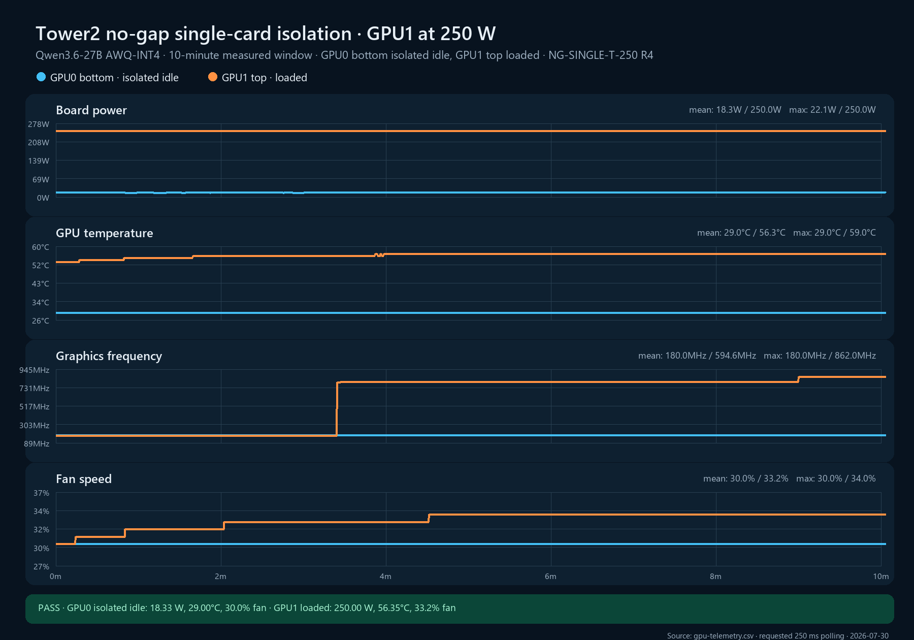

# NG-SINGLE-T-250 replicate 4

**Cell:** NG-SINGLE-T-250  
**Replicate:** 4  
**Measured window:** 10 minutes  
**Layout:** GPU0 bottom and GPU1 top directly adjacent, no open-slot gap  
**Workload:** Qwen3.6-27B AWQ-INT4 on GPU1 with 32 controlled requests; GPU0 isolated idle  
**Power limits:** 250 W on both cards  
**Validation classification:** internally admissible; not transferable without ambient/local-inlet probes

## Result

The replicate passed every automatic quality gate. The one-second service guard stopped an externally restarted OpenClaw gateway during warm-up before it issued a request. The post-run Sanctuary counter delta exactly matched the controlled request log.

| Metric | GPU0 bottom, isolated idle | GPU1 top, loaded |
|---|---:|---:|
| Samples / expected | 2,415 / 2,400 | 2,415 / 2,400 |
| Mean board power | 18.327 W | 249.995 W |
| Mean / max core temperature | 29.000 / 29°C | 56.347 / 59°C |
| Last-5-minute mean temperature | 29.000°C | 57.020°C |
| Mean fan speed | 30.000% | 33.239% |
| Mean graphics clock | 180.000 MHz | 594.629 MHz |
| Last-5-minute mean graphics clock | 180.000 MHz | 814.689 MHz |
| Mean GPU utilization | 0% | 100% |
| Temperature slope, last 3m | 0.0000°C/min | +0.0027°C/min |
| Fan slope, last 3m | 0.0000 pp/min | 0.0000 pp/min |
| SW/HW thermal counter delta | 0 / 0 µs | 0 / 0 µs |
| Hardware power-brake counter delta | 0 µs | 0 µs |

GPU1 completed 544 measured-window requests at 0.9067 requests/s. Mean request duration was 34.968 seconds. Across warm-up and measurement, Sanctuary recorded 672 successful completions and `requests.csv` recorded exactly 672 controlled HTTP 200 responses with zero errors.

The low whole-window clock mean reflects recurring request-boundary 172/405 MHz samples. Independent `dmon` sampling recorded 795–802 MHz with full 13,365 MHz memory clock between those boundaries. Application throughput closely matched replicate 2.

This is the second internally admissible member of the required validation set. The cell is now `n=2/3`, not yet validated.

