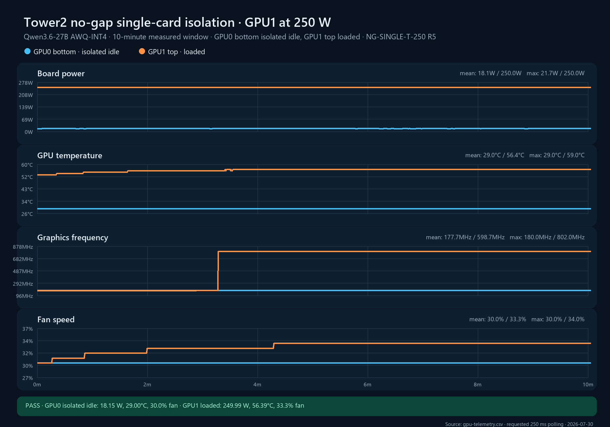

# NG-SINGLE-T-250 replicate 5

**Cell:** NG-SINGLE-T-250  
**Replicate:** 5  
**Measured window:** 10 minutes  
**Layout:** GPU0 bottom and GPU1 top directly adjacent, no open-slot gap  
**Workload:** Qwen3.6-27B AWQ-INT4 on GPU1 with 32 controlled requests; GPU0 isolated idle  
**Power limits:** 250 W on both cards  
**Validation classification:** internally admissible; not transferable without ambient/local-inlet probes

## Result

The replicate passed every automatic quality gate. The service guard kept the OpenClaw gateway from injecting production requests, GPU0 remained below its idle-power ceiling, and the post-run Sanctuary success-counter delta exactly matched the controlled request log.

| Metric | GPU0 bottom, isolated idle | GPU1 top, loaded |
|---|---:|---:|
| Samples / expected | 2,414 / 2,400 | 2,414 / 2,400 |
| Mean board power | 18.150 W | 249.994 W |
| Mean / max core temperature | 29.000 / 29°C | 56.391 / 59°C |
| Last-5-minute mean temperature | 29.000°C | 57.023°C |
| Mean fan speed | 30.000% | 33.258% |
| Mean graphics clock | 177.700 MHz | 598.703 MHz |
| Last-5-minute mean graphics clock | 180.000 MHz | 802.000 MHz |
| Mean GPU utilization | 0% | 100% |
| Temperature slope, last 3m | 0.0000°C/min | −0.0076°C/min |
| Fan slope, last 3m | 0.0000 pp/min | 0.0000 pp/min |
| SW/HW thermal counter delta | 0 / 0 µs | 0 / 0 µs |
| Hardware power-brake counter delta | 0 µs | 0 µs |

GPU1 completed 544 measured-window requests at 0.9067 requests/s. Mean request duration was 34.945 seconds. Across warm-up and measurement, Sanctuary recorded 672 successful completions and `requests.csv` recorded exactly 672 controlled HTTP 200 responses with zero errors.

The low whole-window clock mean reflects recurring request-boundary low-clock samples. The last-five-minute loaded clock was a stable 802 MHz, application throughput exactly matched replicates 2 and 4, and no thermal-slowdown counter increased.

This is the third internally admissible member of the validation set. Together, replicates 2, 4, and 5 establish within-campaign `n=3` repeatability. The three execution blocks were independently initialized and separated by cleanup/cooldown, but occurred in one campaign session; cross-session replication and environmental instrumentation remain required for transferable server-design claims.

