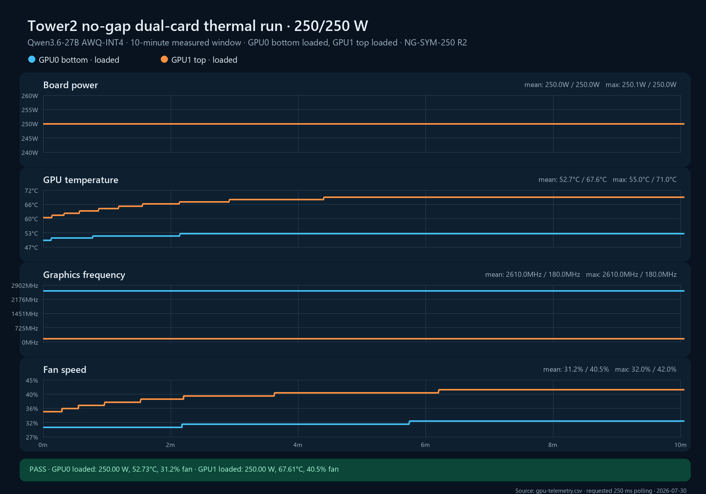

# NG-SYM-250 replicate 2

**Cell:** NG-SYM-250  
**Replicate:** 2  
**Measured window:** 10 minutes  
**Layout:** GPU0 bottom and GPU1 top directly adjacent, no open-slot gap  
**Workload:** independent Qwen3.6-27B AWQ-INT4 engines with 32 controlled request workers per GPU  
**Power limits:** 250 W on both cards  
**Validation classification:** internally admissible for thermal/workload responses; GPU1 clock channel quality-flagged; not transferable without ambient/local-inlet probes

## Result

The replicate passed the workload-isolation, loaded-power, completeness, steady-state, request-accounting, and thermal-counter gates. A failed preflight immediately before this run produced no test artifacts: an external OpenClaw request had heated GPU1 above the 45°C start limit. The gateway was isolated, that request was allowed to drain, GPU1 cooled to 40°C, and only then was this recorded run admitted.

| Metric | GPU0 bottom | GPU1 top |
|---|---:|---:|
| Samples / expected | 2,415 / 2,400 | 2,415 / 2,400 |
| Mean board power | 249.995 W | 249.995 W |
| Mean / max core temperature | 52.730 / 55°C | 67.613 / 71°C |
| Last-5-minute mean temperature | 53.038°C | 69.028°C |
| Mean fan speed | 31.212% | 40.470% |
| Reported mean graphics clock | 2,610 MHz | 180 MHz* |
| Mean GPU utilization | 100% | 100% |
| Temperature slope, last 3m | +0.0142°C/min | −0.0019°C/min |
| Fan slope, last 3m | 0.0000 pp/min | 0.0000 pp/min |
| SW/HW thermal counter delta | 0 / 0 µs | 0 / 0 µs |
| Hardware power-brake counter delta | 0 µs | 0 µs |
| Measured throughput | 1.0133 req/s | 0.8533 req/s |
| Mean request duration | 33.385 s | 37.677 s |

The top card averaged 14.883°C hotter and required 9.258 additional fan-percentage points at identical power. Both cards reached a steady plateau. GPU1/Sanctuary recorded exactly 640 successful completions across all phases, matching 640 controlled GPU1 HTTP 200 responses with zero errors; no unaccounted external request reached the server despite repeated service-manager attempts to restart OpenClaw.

The thermal result closely reproduces the excluded first pilot: the pilot reported 51.849°C bottom, 66.969°C top, and a 15.120°C delta, while this clean run reports 52.730°C, 67.613°C, and 14.883°C. Mean fan speeds differ by only 0.54 percentage points on GPU0 and 0.32 points on GPU1.

## Clock-channel quality flag

GPU1 reported exactly 180 MHz graphics/SM and 405 MHz memory clocks for all 2,415 measured samples while simultaneously holding 249.995 W, 100% utilization, and 0.8533 requests/s. That combination is not credible as a literal sustained clock state and conflicts with the application throughput and earlier independent observations. It is treated as sampling alias/staleness, not thermal throttling.

The run remains admissible for temperature, fan, power, utilization, request performance, and event-counter analysis. Its GPU1 clock samples must not be used to fit a frequency model. Future replicates will add an independent clock stream with an incommensurate sampling cadence before this channel is promoted.

This is the first internally admissible member of the required `n=3` symmetric 250 W validation set. The earlier replicate 1 pilot remains published but excluded because OpenClaw GPU0 workers were not isolated.

